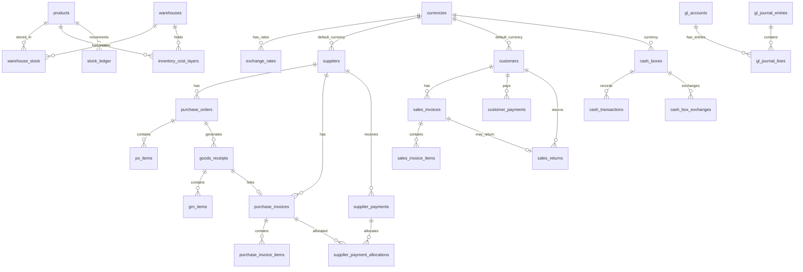

# 📊 تحليل مخطط قاعدة البيانات - نظام ERP الصيدلية
## Database Schema Analysis Report

**تاريخ التقرير:** 2024-12-18  
**إجمالي الجداول:** 95+ جدول  
**العملة الأساسية:** YER (الريال اليمني)

---

## 📋 الفهرس

1. [ملخص تنفيذي](#ملخص-تنفيذي)
2. [جداول المشتريات (Purchasing)](#جداول-المشتريات-purchasing)
3. [جداول المخزون (Inventory)](#جداول-المخزون-inventory)
4. [جداول المحاسبة (Accounting/GL)](#جداول-المحاسبة-accountinggl)
5. [جداول الموردين والعملات](#جداول-الموردين-والعملات)
6. [جداول المبيعات (Sales)](#جداول-المبيعات-sales)
7. [جداول العملاء (Customers)](#جداول-العملاء-customers)
8. [جداول الموظفين والصلاحيات](#جداول-الموظفين-والصلاحيات)
9. [جداول الصيدلية الخاصة](#جداول-الصيدلية-الخاصة)
10. [العلاقات ERD](#العلاقات-erd)
11. [الجداول الحرجة](#الجداول-الحرجة)

---

## ملخص تنفيذي

| الوحدة | عدد الجداول | الحالة |
|--------|-------------|--------|
| المشتريات | 12 | ✅ مكتمل 78% |
| المخزون | 10 | ✅ مكتمل 85% |
| المحاسبة | 15 | ✅ مكتمل 90% |
| الموردين/العملات | 4 | ✅ مكتمل 95% |
| المبيعات | 8 | ✅ مكتمل 85% |
| العملاء | 12 | ✅ مكتمل 90% |
| الموظفين | 8 | ✅ مكتمل 85% |
| الصيدلية | 10 | ✅ مكتمل 80% |
| التدقيق/الأمان | 5 | ✅ مكتمل 95% |

---

## جداول المشتريات (Purchasing)

### 1. `suppliers` - الموردين
| العمود | النوع | الوصف | FK |
|--------|------|-------|-----|
| `id` | UUID | PK | - |
| `supplier_code` | TEXT | كود المورد | - |
| `name` | TEXT | اسم المورد | - |
| `currency_code` | TEXT | عملة المورد | → currencies.code |
| `balance` | DECIMAL | رصيد المورد (YER) | - |
| `credit_limit` | DECIMAL | حد الائتمان | - |
| `payment_terms` | TEXT | شروط الدفع | - |
| `is_active` | BOOLEAN | نشط/غير نشط | - |

### 2. `purchase_orders` - أوامر الشراء
| العمود | النوع | الوصف | FK |
|--------|------|-------|-----|
| `id` | UUID | PK | - |
| `po_number` | TEXT | رقم أمر الشراء | - |
| `supplier_id` | UUID | المورد | → suppliers.id |
| `warehouse_id` | UUID | المستودع | → warehouses.id |
| `currency_code` | TEXT | العملة | → currencies.code |
| `exchange_rate` | DECIMAL | سعر الصرف | - |
| `subtotal_fc` | DECIMAL | المجموع الفرعي FC | - |
| `subtotal_bc` | DECIMAL | المجموع الفرعي BC | - |
| `tax_amount_fc/bc` | DECIMAL | الضريبة | - |
| `total_amount_fc/bc` | DECIMAL | الإجمالي | - |
| `status` | TEXT | الحالة (draft/approved/received) | - |
| `created_by` | UUID | منشئ الأمر | - |

### 3. `po_items` - بنود أوامر الشراء
| العمود | النوع | الوصف | FK |
|--------|------|-------|-----|
| `id` | UUID | PK | - |
| `po_id` | UUID | أمر الشراء | → purchase_orders.id |
| `item_id` | UUID | المنتج | → products.id |
| `quantity` | DECIMAL | الكمية المطلوبة | - |
| `received_qty` | DECIMAL | الكمية المستلمة | - |
| `unit_price_fc/bc` | DECIMAL | سعر الوحدة | - |
| `line_total_fc/bc` | DECIMAL | إجمالي البند | - |

### 4. `goods_receipts` - سندات استلام البضائع (GRN)
| العمود | النوع | الوصف | FK |
|--------|------|-------|-----|
| `id` | UUID | PK | - |
| `grn_number` | TEXT | رقم سند الاستلام | - |
| `po_id` | UUID | أمر الشراء | → purchase_orders.id |
| `supplier_id` | UUID | المورد | → suppliers.id |
| `warehouse_id` | UUID | المستودع | → warehouses.id |
| `status` | TEXT | الحالة (draft/posted) | - |
| `posted_at` | TIMESTAMP | تاريخ الترحيل | - |

### 5. `grn_items` - بنود سند الاستلام
| العمود | النوع | الوصف | FK |
|--------|------|-------|-----|
| `id` | UUID | PK | - |
| `grn_id` | UUID | سند الاستلام | → goods_receipts.id |
| `item_id` | UUID | المنتج | → products.id |
| `quantity` | DECIMAL | الكمية المستلمة | - |
| `unit_cost` | DECIMAL | تكلفة الوحدة | - |
| `batch_number` | TEXT | رقم الدفعة | - |
| `expiry_date` | DATE | تاريخ انتهاء الصلاحية | - |

### 6. `purchase_invoices` - فواتير المشتريات
| العمود | النوع | الوصف | FK |
|--------|------|-------|-----|
| `id` | UUID | PK | - |
| `pi_number` | TEXT | رقم الفاتورة | - |
| `supplier_invoice_no` | TEXT | رقم فاتورة المورد | - |
| `supplier_id` | UUID | المورد | → suppliers.id |
| `po_id` | UUID | أمر الشراء | → purchase_orders.id |
| `grn_id` | UUID | سند الاستلام | → goods_receipts.id |
| `currency_code` | TEXT | العملة | → currencies.code |
| `exchange_rate` | DECIMAL | سعر الصرف | - |
| `subtotal_fc/bc` | DECIMAL | المجموع الفرعي | - |
| `tax_amount_fc/bc` | DECIMAL | الضريبة | - |
| `discount_amount_fc/bc` | DECIMAL | الخصم | - |
| `total_amount_fc/bc` | DECIMAL | الإجمالي | - |
| `paid_amount_fc/bc` | DECIMAL | المدفوع | - |
| `payment_status` | TEXT | حالة الدفع | - |
| `status` | TEXT | الحالة (draft/posted) | - |

### 7. `purchase_invoice_items` - بنود فواتير المشتريات
| العمود | النوع | الوصف | FK |
|--------|------|-------|-----|
| `id` | UUID | PK | - |
| `invoice_id` | UUID | الفاتورة | → purchase_invoices.id |
| `item_id` | UUID | المنتج | → products.id |
| `quantity` | DECIMAL | الكمية | - |
| `unit_price_fc/bc` | DECIMAL | سعر الوحدة | - |
| `tax_amount` | DECIMAL | الضريبة | - |
| `line_total_fc/bc` | DECIMAL | إجمالي البند | - |

### 8. `purchase_returns` - مرتجعات المشتريات
| العمود | النوع | الوصف | FK |
|--------|------|-------|-----|
| `id` | UUID | PK | - |
| `return_number` | TEXT | رقم المرتجع | - |
| `supplier_id` | UUID | المورد | → suppliers.id |
| `purchase_invoice_id` | UUID | فاتورة الشراء | → purchase_invoices.id |
| `total_amount` | DECIMAL | إجمالي المرتجع | - |
| `status` | TEXT | الحالة | - |

### 9. `supplier_payments` - مدفوعات الموردين
| العمود | النوع | الوصف | FK |
|--------|------|-------|-----|
| `id` | UUID | PK | - |
| `payment_number` | TEXT | رقم الدفعة | - |
| `supplier_id` | UUID | المورد | → suppliers.id |
| `amount_fc/bc` | DECIMAL | المبلغ | - |
| `currency_code` | TEXT | العملة | → currencies.code |
| `exchange_rate` | DECIMAL | سعر الصرف | - |
| `payment_method` | TEXT | طريقة الدفع | - |
| `status` | TEXT | الحالة | - |

### 10. `supplier_payment_allocations` - تخصيص مدفوعات الموردين
| العمود | النوع | الوصف | FK |
|--------|------|-------|-----|
| `id` | UUID | PK | - |
| `payment_id` | UUID | الدفعة | → supplier_payments.id |
| `invoice_id` | UUID | الفاتورة | → purchase_invoices.id |
| `allocated_amount` | DECIMAL | المبلغ المخصص | - |

---

## جداول المخزون (Inventory)

### 1. `products` - المنتجات
| العمود | النوع | الوصف | FK |
|--------|------|-------|-----|
| `id` | UUID | PK | - |
| `name` | TEXT | اسم المنتج | - |
| `sku` | TEXT | رمز المخزون | - |
| `barcode` | TEXT | الباركود | - |
| `category_id` | UUID | التصنيف | → categories.id |
| `manufacturer_id` | UUID | الشركة المصنعة | → manufacturers.id |
| `base_uom_id` | UUID | وحدة القياس | → uoms.id |
| `cost_price` | DECIMAL | سعر التكلفة | - |
| `price` | DECIMAL | سعر البيع | - |
| `reorder_level` | INT | نقطة إعادة الطلب | - |
| `is_active` | BOOLEAN | نشط | - |

### 2. `warehouses` - المستودعات
| العمود | النوع | الوصف | FK |
|--------|------|-------|-----|
| `id` | UUID | PK | - |
| `code` | TEXT | كود المستودع | - |
| `name` | TEXT | اسم المستودع | - |
| `is_default` | BOOLEAN | المستودع الافتراضي | - |
| `is_active` | BOOLEAN | نشط | - |
| `parent_warehouse_id` | UUID | المستودع الأب | → warehouses.id |

### 3. `warehouse_stock` - مخزون المستودعات ⚠️ حرج
| العمود | النوع | الوصف | FK |
|--------|------|-------|-----|
| `warehouse_id` | UUID | PK (مركب) | → warehouses.id |
| `item_id` | UUID | PK (مركب) | → products.id |
| `qty_on_hand` | DECIMAL | الكمية المتاحة | - |
| `qty_reserved` | DECIMAL | الكمية المحجوزة | - |
| `qty_inbound` | DECIMAL | الكمية الواردة | - |
| `qty_outbound` | DECIMAL | الكمية الصادرة | - |

### 4. `inventory_cost_layers` - طبقات التكلفة FIFO ⚠️ حرج جداً
| العمود | النوع | الوصف | FK |
|--------|------|-------|-----|
| `id` | UUID | PK | - |
| `product_id` | UUID | المنتج | → products.id |
| `warehouse_id` | UUID | المستودع | → warehouses.id |
| `source_document_type` | TEXT | نوع المستند (GRN/ADJ) | - |
| `source_document_id` | UUID | معرف المستند | - |
| `quantity_original` | DECIMAL | الكمية الأصلية | - |
| `quantity_remaining` | DECIMAL | الكمية المتبقية | - |
| `unit_cost` | DECIMAL | تكلفة الوحدة (BC) | - |
| `batch_number` | TEXT | رقم الدفعة | - |
| `expiry_date` | DATE | تاريخ انتهاء الصلاحية | - |

### 5. `stock_ledger` - سجل حركة المخزون
| العمود | النوع | الوصف | FK |
|--------|------|-------|-----|
| `id` | UUID | PK | - |
| `item_id` | UUID | المنتج | → products.id |
| `warehouse_id` | UUID | المستودع | → warehouses.id |
| `reference_type` | TEXT | نوع المرجع | - |
| `reference_id` | UUID | معرف المرجع | - |
| `qty_in` | DECIMAL | الكمية الداخلة | - |
| `qty_out` | DECIMAL | الكمية الخارجة | - |
| `unit_cost` | DECIMAL | تكلفة الوحدة | - |
| `running_qty` | DECIMAL | الرصيد الجاري | - |

### 6. `warehouse_batches` - دفعات المستودع
| العمود | النوع | الوصف | FK |
|--------|------|-------|-----|
| `id` | UUID | PK | - |
| `warehouse_id` | UUID | المستودع | → warehouses.id |
| `item_id` | UUID | المنتج | → products.id |
| `lot_no` | TEXT | رقم الدفعة | - |
| `qty_on_hand` | DECIMAL | الكمية المتاحة | - |
| `unit_cost` | DECIMAL | تكلفة الوحدة | - |
| `expiry_date` | DATE | تاريخ انتهاء الصلاحية | - |

### 7. `product_batches` - دفعات المنتج
| العمود | النوع | الوصف | FK |
|--------|------|-------|-----|
| `id` | UUID | PK | - |
| `product_id` | UUID | المنتج | → products.id |
| `batch_number` | TEXT | رقم الدفعة | - |
| `quantity` | DECIMAL | الكمية | - |
| `cost_price` | DECIMAL | سعر التكلفة | - |
| `expiry_date` | DATE | تاريخ انتهاء الصلاحية | - |

### 8. `stock_adjustments` - تسويات المخزون
| العمود | النوع | الوصف | FK |
|--------|------|-------|-----|
| `id` | UUID | PK | - |
| `adjustment_number` | TEXT | رقم التسوية | - |
| `warehouse_id` | UUID | المستودع | → warehouses.id |
| `adjustment_type` | TEXT | نوع التسوية | - |
| `status` | TEXT | الحالة | - |

### 9. `warehouse_transfers` - تحويلات المستودعات
| العمود | النوع | الوصف | FK |
|--------|------|-------|-----|
| `id` | UUID | PK | - |
| `transfer_number` | TEXT | رقم التحويل | - |
| `from_warehouse_id` | UUID | من مستودع | → warehouses.id |
| `to_warehouse_id` | UUID | إلى مستودع | → warehouses.id |
| `status` | TEXT | الحالة | - |

---

## جداول المحاسبة (Accounting/GL)

### 1. `gl_accounts` - دليل الحسابات ⚠️ حرج
| العمود | النوع | الوصف | FK |
|--------|------|-------|-----|
| `id` | UUID | PK | - |
| `account_code` | TEXT | كود الحساب | - |
| `account_name` | TEXT | اسم الحساب | - |
| `account_type` | TEXT | نوع الحساب (Asset/Liability/Equity/Revenue/Expense) | - |
| `parent_account_id` | UUID | الحساب الأب | → gl_accounts.id |
| `is_header` | BOOLEAN | حساب رئيسي | - |
| `is_active` | BOOLEAN | نشط | - |

### 2. `gl_journal_entries` - القيود اليومية ⚠️ حرج جداً
| العمود | النوع | الوصف | FK |
|--------|------|-------|-----|
| `id` | UUID | PK | - |
| `entry_no` | TEXT | رقم القيد | - |
| `entry_date` | DATE | تاريخ القيد | - |
| `posting_date` | DATE | تاريخ الترحيل | - |
| `description` | TEXT | الوصف | - |
| `source_module` | TEXT | الوحدة المصدر | - |
| `source_document_id` | UUID | معرف المستند | - |
| `is_posted` | BOOLEAN | مرحل | - |
| `is_reversed` | BOOLEAN | معكوس | - |
| `total_debit` | DECIMAL | إجمالي المدين | - |
| `total_credit` | DECIMAL | إجمالي الدائن | - |

### 3. `gl_journal_lines` - بنود القيود اليومية ⚠️ حرج جداً
| العمود | النوع | الوصف | FK |
|--------|------|-------|-----|
| `id` | UUID | PK | - |
| `journal_entry_id` | UUID | القيد | → gl_journal_entries.id |
| `account_id` | UUID | الحساب | → gl_accounts.id |
| `debit_fc` | DECIMAL | مدين FC | - |
| `credit_fc` | DECIMAL | دائن FC | - |
| `debit_bc` | DECIMAL | مدين BC (YER) | - |
| `credit_bc` | DECIMAL | دائن BC (YER) | - |
| `currency_code` | TEXT | العملة | → currencies.code |
| `exchange_rate` | DECIMAL | سعر الصرف | - |
| `cost_center_id` | UUID | مركز التكلفة | → cost_centers.id |

### 4. `journal_entries` - قيود اليومية (Legacy)
| العمود | النوع | الوصف | FK |
|--------|------|-------|-----|
| `id` | UUID | PK | - |
| `entry_number` | TEXT | رقم القيد | - |
| `entry_date` | DATE | تاريخ القيد | - |
| `is_posted` | BOOLEAN | مرحل | - |

### 5. `accounting_periods` - الفترات المحاسبية
| العمود | النوع | الوصف | FK |
|--------|------|-------|-----|
| `id` | UUID | PK | - |
| `period_name` | TEXT | اسم الفترة | - |
| `fiscal_year` | INT | السنة المالية | - |
| `start_date` | DATE | تاريخ البداية | - |
| `end_date` | DATE | تاريخ النهاية | - |
| `is_closed` | BOOLEAN | مغلقة | - |

### 6. `cost_centers` - مراكز التكلفة
| العمود | النوع | الوصف | FK |
|--------|------|-------|-----|
| `id` | UUID | PK | - |
| `code` | TEXT | الكود | - |
| `name` | TEXT | الاسم | - |
| `parent_id` | UUID | المركز الأب | → cost_centers.id |
| `budget_amount` | DECIMAL | الميزانية | - |
| `actual_amount` | DECIMAL | الفعلي | - |

### 7. `erp_account_mappings` - ربط الحسابات
| العمود | النوع | الوصف | FK |
|--------|------|-------|-----|
| `id` | UUID | PK | - |
| `module` | TEXT | الوحدة | - |
| `operation` | TEXT | العملية | - |
| `debit_account_id` | UUID | حساب المدين | → gl_accounts.id |
| `credit_account_id` | UUID | حساب الدائن | → gl_accounts.id |

### 8. `cash_boxes` - الصناديق النقدية
| العمود | النوع | الوصف | FK |
|--------|------|-------|-----|
| `id` | UUID | PK | - |
| `box_code` | TEXT | كود الصندوق | - |
| `box_name` | TEXT | اسم الصندوق | - |
| `currency_code` | TEXT | العملة | → currencies.code |
| `current_balance` | DECIMAL | الرصيد الحالي | - |
| `gl_account_id` | UUID | حساب GL | → gl_accounts.id |

### 9. `cash_transactions` - حركات النقدية
| العمود | النوع | الوصف | FK |
|--------|------|-------|-----|
| `id` | UUID | PK | - |
| `cash_box_id` | UUID | الصندوق | → cash_boxes.id |
| `transaction_type` | TEXT | نوع الحركة | - |
| `amount_fc` | DECIMAL | المبلغ FC | - |
| `amount_bc` | DECIMAL | المبلغ BC | - |
| `currency_code` | TEXT | العملة | - |
| `exchange_rate` | DECIMAL | سعر الصرف | - |

### 10. `cash_box_exchanges` - مصارفة العملات
| العمود | النوع | الوصف | FK |
|--------|------|-------|-----|
| `id` | UUID | PK | - |
| `from_cash_box_id` | UUID | من صندوق | → cash_boxes.id |
| `to_cash_box_id` | UUID | إلى صندوق | → cash_boxes.id |
| `from_currency` | TEXT | من عملة | → currencies.code |
| `to_currency` | TEXT | إلى عملة | → currencies.code |
| `exchange_rate` | DECIMAL | سعر الصرف | - |
| `from_amount` | DECIMAL | المبلغ المحول | - |
| `to_amount` | DECIMAL | المبلغ المستلم | - |

### 11. `taxes` - الضرائب
| العمود | النوع | الوصف | FK |
|--------|------|-------|-----|
| `id` | UUID | PK | - |
| `name` | TEXT | اسم الضريبة | - |
| `code` | TEXT | كود الضريبة | - |
| `rate` | DECIMAL | نسبة الضريبة | - |
| `is_active` | BOOLEAN | نشطة | - |

### 12. `vat_returns` - إقرارات الضريبة
| العمود | النوع | الوصف | FK |
|--------|------|-------|-----|
| `id` | UUID | PK | - |
| `return_number` | TEXT | رقم الإقرار | - |
| `tax_period_id` | UUID | الفترة الضريبية | → tax_periods.id |
| `output_vat` | DECIMAL | ضريبة المخرجات | - |
| `input_vat` | DECIMAL | ضريبة المدخلات | - |
| `net_vat` | DECIMAL | صافي الضريبة | - |
| `status` | TEXT | الحالة | - |

---

## جداول الموردين والعملات

### 1. `currencies` - العملات ⚠️ حرج
| العمود | النوع | الوصف | FK |
|--------|------|-------|-----|
| `code` | TEXT | PK (YER, SAR, USD) | - |
| `name` | TEXT | اسم العملة | - |
| `symbol` | TEXT | الرمز | - |
| `is_base` | BOOLEAN | العملة الأساسية | - |
| `is_active` | BOOLEAN | نشطة | - |
| `precision` | INT | عدد الخانات العشرية | - |

### 2. `exchange_rates` - أسعار الصرف ⚠️ حرج
| العمود | النوع | الوصف | FK |
|--------|------|-------|-----|
| `id` | UUID | PK | - |
| `from_currency` | TEXT | من عملة | → currencies.code |
| `to_currency` | TEXT | إلى عملة | → currencies.code |
| `rate` | DECIMAL | سعر الصرف | - |
| `effective_date` | DATE | تاريخ السريان | - |
| `is_active` | BOOLEAN | نشط | - |

---

## جداول المبيعات (Sales)

### 1. `sales_invoices` - فواتير المبيعات
| العمود | النوع | الوصف | FK |
|--------|------|-------|-----|
| `id` | UUID | PK | - |
| `invoice_number` | TEXT | رقم الفاتورة | - |
| `customer_id` | UUID | العميل | → customers.id |
| `warehouse_id` | UUID | المستودع | → warehouses.id |
| `currency_code` | TEXT | العملة | → currencies.code |
| `exchange_rate` | DECIMAL | سعر الصرف | - |
| `subtotal` | DECIMAL | المجموع الفرعي | - |
| `discount_amount` | DECIMAL | الخصم | - |
| `tax_amount` | DECIMAL | الضريبة | - |
| `total_amount` | DECIMAL | الإجمالي FC | - |
| `base_currency_total` | DECIMAL | الإجمالي BC | - |
| `paid_amount` | DECIMAL | المدفوع | - |
| `status` | TEXT | الحالة | - |

### 2. `sales_invoice_items` - بنود فواتير المبيعات
| العمود | النوع | الوصف | FK |
|--------|------|-------|-----|
| `id` | UUID | PK | - |
| `invoice_id` | UUID | الفاتورة | → sales_invoices.id |
| `item_id` | UUID | المنتج | → products.id |
| `quantity` | DECIMAL | الكمية | - |
| `unit_price` | DECIMAL | سعر الوحدة | - |
| `discount_percentage` | DECIMAL | نسبة الخصم | - |
| `line_total` | DECIMAL | إجمالي البند | - |

### 3. `sales_returns` - مرتجعات المبيعات
| العمود | النوع | الوصف | FK |
|--------|------|-------|-----|
| `id` | UUID | PK | - |
| `return_number` | TEXT | رقم المرتجع | - |
| `sales_invoice_id` | UUID | فاتورة البيع | → sales_invoices.id |
| `customer_id` | UUID | العميل | → customers.id |
| `total_amount` | DECIMAL | إجمالي المرتجع | - |
| `refund_amount` | DECIMAL | المبلغ المسترد | - |
| `status` | TEXT | الحالة | - |

### 4. `customer_payments` - مدفوعات العملاء
| العمود | النوع | الوصف | FK |
|--------|------|-------|-----|
| `id` | UUID | PK | - |
| `payment_number` | TEXT | رقم الدفعة | - |
| `customer_id` | UUID | العميل | → customers.id |
| `amount` | DECIMAL | المبلغ | - |
| `payment_method` | TEXT | طريقة الدفع | - |
| `status` | TEXT | الحالة | - |

### 5. `pos_sessions` - جلسات نقاط البيع
| العمود | النوع | الوصف | FK |
|--------|------|-------|-----|
| `id` | UUID | PK | - |
| `session_number` | TEXT | رقم الجلسة | - |
| `user_id` | UUID | المستخدم | - |
| `cash_box_id` | UUID | الصندوق | → cash_boxes.id |
| `opening_balance` | DECIMAL | الرصيد الافتتاحي | - |
| `closing_balance` | DECIMAL | الرصيد الختامي | - |
| `status` | TEXT | الحالة | - |

---

## جداول العملاء (Customers)

### 1. `customers` - العملاء
| العمود | النوع | الوصف | FK |
|--------|------|-------|-----|
| `id` | UUID | PK | - |
| `name` | TEXT | اسم العميل | - |
| `phone` | TEXT | الهاتف | - |
| `email` | TEXT | البريد الإلكتروني | - |
| `address` | TEXT | العنوان | - |
| `currency_code` | TEXT | العملة | → currencies.code |
| `balance` | DECIMAL | الرصيد (YER) | - |
| `credit_limit` | DECIMAL | حد الائتمان | - |
| `loyalty_points` | INT | نقاط الولاء | - |
| `is_active` | BOOLEAN | نشط | - |
| `user_id` | UUID | مرتبط بمستخدم | - |

### 2. `customer_health_records` - السجلات الصحية (حساس) 🔒
| العمود | النوع | الوصف | FK |
|--------|------|-------|-----|
| `id` | UUID | PK | - |
| `customer_id` | UUID | العميل | → customers.id |
| `blood_type` | TEXT | فصيلة الدم | - |
| `allergies` | TEXT[] | الحساسيات | - |
| `chronic_diseases` | TEXT[] | الأمراض المزمنة | - |
| `current_medications` | TEXT[] | الأدوية الحالية | - |

### 3. `customer_insurance` - تأمين العملاء
| العمود | النوع | الوصف | FK |
|--------|------|-------|-----|
| `id` | UUID | PK | - |
| `customer_id` | UUID | العميل | → customers.id |
| `insurance_company_id` | UUID | شركة التأمين | → insurance_companies.id |
| `policy_number` | TEXT | رقم البوليصة | - |
| `coverage_percentage` | DECIMAL | نسبة التغطية | - |

---

## جداول الموظفين والصلاحيات

### 1. `employees` - الموظفين
| العمود | النوع | الوصف | FK |
|--------|------|-------|-----|
| `id` | UUID | PK | - |
| `employee_code` | TEXT | كود الموظف | - |
| `full_name` | TEXT | الاسم الكامل | - |
| `department` | TEXT | القسم | - |
| `job_title` | TEXT | المسمى الوظيفي | - |
| `phone` | TEXT | الهاتف | - |
| `email` | TEXT | البريد | - |
| `hire_date` | DATE | تاريخ التعيين | - |
| `is_active` | BOOLEAN | نشط | - |
| `user_id` | UUID | مرتبط بمستخدم | - |

### 2. `employee_salaries` - رواتب الموظفين (حساس) 🔒
| العمود | النوع | الوصف | FK |
|--------|------|-------|-----|
| `employee_id` | UUID | PK | → employees.id |
| `salary` | DECIMAL | الراتب | - |
| `national_id_enc` | BYTEA | الهوية (مشفرة) | - |

### 3. `user_roles` - أدوار المستخدمين
| العمود | النوع | الوصف | FK |
|--------|------|-------|-----|
| `id` | UUID | PK | - |
| `user_id` | UUID | المستخدم | - |
| `role` | ENUM | الدور (admin/pharmacist/cashier/inventory_manager) | - |

### 4. `roles` - الأدوار
| العمود | النوع | الوصف | FK |
|--------|------|-------|-----|
| `id` | UUID | PK | - |
| `role_name` | TEXT | اسم الدور | - |
| `description` | TEXT | الوصف | - |

### 5. `permissions` - الصلاحيات
| العمود | النوع | الوصف | FK |
|--------|------|-------|-----|
| `id` | UUID | PK | - |
| `permission_key` | TEXT | مفتاح الصلاحية | - |
| `permission_name` | TEXT | اسم الصلاحية | - |
| `category` | TEXT | الفئة | - |

### 6. `role_permissions` - صلاحيات الأدوار
| العمود | النوع | الوصف | FK |
|--------|------|-------|-----|
| `id` | UUID | PK | - |
| `role_id` | UUID | الدور | → roles.id |
| `permission_id` | UUID | الصلاحية | → permissions.id |

---

## جداول الصيدلية الخاصة

### 1. `prescriptions` - الوصفات الطبية
| العمود | النوع | الوصف | FK |
|--------|------|-------|-----|
| `id` | UUID | PK | - |
| `prescription_number` | TEXT | رقم الوصفة | - |
| `customer_id` | UUID | العميل | → customers.id |
| `doctor_id` | UUID | الطبيب | → doctors.id |
| `status` | TEXT | الحالة | - |

### 2. `medication_history` - سجل الأدوية
| العمود | النوع | الوصف | FK |
|--------|------|-------|-----|
| `id` | UUID | PK | - |
| `customer_id` | UUID | العميل | → customers.id |
| `product_id` | UUID | المنتج | → products.id |
| `prescription_id` | UUID | الوصفة | → prescriptions.id |
| `dispensed_date` | DATE | تاريخ الصرف | - |

### 3. `drug_interactions` - تفاعلات الأدوية
| العمود | النوع | الوصف | FK |
|--------|------|-------|-----|
| `id` | UUID | PK | - |
| `drug1_id` | UUID | الدواء الأول | → products.id |
| `drug2_id` | UUID | الدواء الثاني | → products.id |
| `severity` | TEXT | شدة التفاعل | - |

### 4. `doctors` - الأطباء
| العمود | النوع | الوصف | FK |
|--------|------|-------|-----|
| `id` | UUID | PK | - |
| `name` | TEXT | اسم الطبيب | - |
| `specialty` | TEXT | التخصص | - |
| `license_number` | TEXT | رقم الترخيص | - |

---

## العلاقات ERD



### العلاقات النصية الرئيسية

```
┌─────────────────────────────────────────────────────────────────┐
│                    دورة المشتريات الكاملة                        │
├─────────────────────────────────────────────────────────────────┤
│                                                                 │
│  suppliers ──┬──> purchase_orders ──> po_items                  │
│              │         │                                        │
│              │         ▼                                        │
│              │    goods_receipts ──> grn_items                  │
│              │         │        ╲                               │
│              │         │         ╲──> inventory_cost_layers     │
│              │         │          ╲──> warehouse_stock          │
│              │         ▼                                        │
│              └──> purchase_invoices ──> purchase_invoice_items  │
│                        │                                        │
│                        ▼                                        │
│              supplier_payments ──> supplier_payment_allocations │
│                        │                                        │
│                        ▼                                        │
│              gl_journal_entries ──> gl_journal_lines            │
│                                                                 │
└─────────────────────────────────────────────────────────────────┘

┌─────────────────────────────────────────────────────────────────┐
│                    دورة المبيعات الكاملة                         │
├─────────────────────────────────────────────────────────────────┤
│                                                                 │
│  customers ──┬──> sales_invoices ──> sales_invoice_items        │
│              │         │        ╲                               │
│              │         │         ╲──> inventory_cost_layers     │
│              │         │          ╲──> warehouse_stock          │
│              │         ▼                                        │
│              ├──> customer_payments                             │
│              │         │                                        │
│              │         ▼                                        │
│              └──> sales_returns ──> sales_return_items          │
│                        │                                        │
│                        ▼                                        │
│              gl_journal_entries ──> gl_journal_lines            │
│                                                                 │
└─────────────────────────────────────────────────────────────────┘

┌─────────────────────────────────────────────────────────────────┐
│                    تدفق العملات                                  │
├─────────────────────────────────────────────────────────────────┤
│                                                                 │
│  currencies (YER = base)                                        │
│       │                                                         │
│       ├──> exchange_rates (YER/SAR, YER/USD)                    │
│       │                                                         │
│       ├──> suppliers.currency_code                              │
│       ├──> customers.currency_code                              │
│       ├──> cash_boxes.currency_code                             │
│       │                                                         │
│       └──> All invoices (FC + BC amounts)                       │
│                 │                                               │
│                 ▼                                                │
│            GL always in YER (base currency)                     │
│                                                                 │
└─────────────────────────────────────────────────────────────────┘
```

---

## الجداول الحرجة

### ⛔ لا يجب كسرها أثناء إضافة PR/RFQ/Approvals

| الجدول | السبب | تأثير الكسر |
|--------|-------|-------------|
| `gl_accounts` | أساس كل القيود المحاسبية | توقف كامل للنظام المحاسبي |
| `gl_journal_entries` | قيود يومية | فقدان البيانات المالية |
| `gl_journal_lines` | بنود القيود | خلل في الأرصدة |
| `currencies` | تعريف العملات | فشل كل العمليات متعددة العملات |
| `exchange_rates` | أسعار الصرف | حسابات خاطئة |
| `inventory_cost_layers` | تكلفة FIFO | تكلفة بضاعة خاطئة |
| `warehouse_stock` | أرصدة المخزون | بيانات مخزون خاطئة |
| `suppliers` | بيانات الموردين | فشل دورة المشتريات |
| `products` | بيانات المنتجات | فشل كل العمليات |
| `purchase_orders` | أوامر الشراء | فقدان الطلبيات |
| `purchase_invoices` | فواتير الشراء | فقدان البيانات المالية |
| `accounting_periods` | الفترات المحاسبية | ترحيل لفترات خاطئة |

### ✅ جداول آمنة للإضافة عليها

| الجدول المقترح | العلاقة | ملاحظات |
|----------------|---------|---------|
| `purchase_requisitions` | → suppliers, → products | جديد - لا يؤثر على الحالي |
| `pr_items` | → purchase_requisitions, → products | جديد |
| `rfq_requests` | → purchase_requisitions, → suppliers | جديد |
| `rfq_quotes` | → rfq_requests, → suppliers | جديد |
| `approval_workflows` | مستقل | جديد |
| `approval_steps` | → approval_workflows | جديد |
| `approval_history` | → purchase_orders, → purchase_invoices | جديد - يربط بالموجود |

### 🔗 نقاط الربط المقترحة للميزات الجديدة

```sql
-- طلبات الشراء PR تربط بـ:
purchase_requisitions.supplier_id → suppliers.id
purchase_requisitions.warehouse_id → warehouses.id
pr_items.item_id → products.id

-- عند تحويل PR إلى PO:
purchase_orders.pr_id → purchase_requisitions.id (جديد)

-- RFQ تربط بـ:
rfq_requests.pr_id → purchase_requisitions.id
rfq_quotes.supplier_id → suppliers.id

-- Approvals تربط بـ:
approval_history.document_type = 'PO' | 'PR' | 'PI'
approval_history.document_id → (purchase_orders.id | purchase_requisitions.id | purchase_invoices.id)
```

---

## ملخص الإحصائيات

| الوحدة | الجداول الرئيسية | الجداول الفرعية | الإجمالي |
|--------|------------------|-----------------|----------|
| المشتريات | 6 | 4 | 10 |
| المخزون | 4 | 5 | 9 |
| المحاسبة | 8 | 7 | 15 |
| المبيعات | 4 | 4 | 8 |
| العملاء | 3 | 9 | 12 |
| الموظفين | 3 | 5 | 8 |
| الصيدلية | 5 | 5 | 10 |
| الإعدادات | 8 | 5 | 13 |
| التدقيق | 3 | 2 | 5 |
| **الإجمالي** | **44** | **46** | **90+** |

---

**تم إنشاء هذا التقرير بواسطة Lovable AI**  
**آخر تحديث:** 2024-12-18
