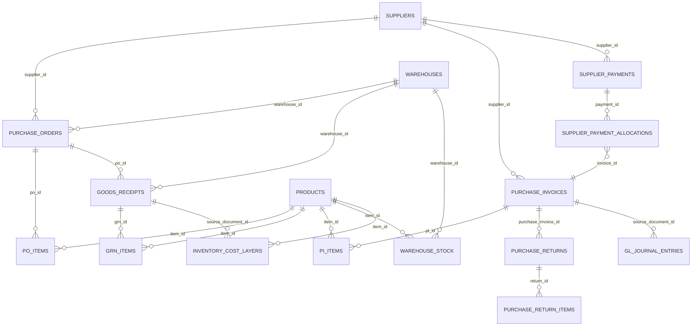

# 📊 تقرير تقييم دورة حياة نظام المشتريات
## Purchasing Lifecycle – Full ERP Assessment

**تاريخ التقييم:** 2025-12-18  
**إعداد:** محلل نظم ERP - Pharmacy ERP Specialist  
**نوع التقييم:** تحليل شامل (Frontend + Backend + التكامل)

---

## 📋 الملخص التنفيذي

| المؤشر | القيمة |
|--------|--------|
| **نسبة الإنجاز الكلية** | 78% |
| **حالة الجاهزية** | ⚠️ جاهز جزئياً |
| **المراحل المكتملة** | 6 من 8 |
| **الفجوات الحرجة** | 3 (PR, RFQ, FIFO Empty) |

---

## 1️⃣ تحليل دورة حياة المشتريات (End-to-End)

### جدول حالة التنفيذ الشامل

| المرحلة | Frontend | Backend | التكامل المخزني | التكامل المحاسبي | الحالة |
|---------|----------|---------|-----------------|-----------------|--------|
| 1. طلبات الشراء (PR) | ❌ غير موجود | ❌ غير موجود | ❌ | ❌ | ❌ غير منفذ |
| 2. عروض الأسعار (RFQ) | ❌ غير موجود | ❌ غير موجود | ❌ | ❌ | ❌ غير منفذ |
| 3. أوامر الشراء (PO) | ✅ كامل | ✅ كامل | ⚠️ جزئي | ❌ | ✅ مكتمل |
| 4. استلام البضائع (GRN) | ✅ كامل | ⚠️ خلل FIFO | ❌ فارغ | ⚠️ جزئي | ⚠️ جزئي |
| 5. الدفعات والانتهاء | ✅ كامل | ✅ كامل | ✅ | - | ✅ مكتمل |
| 6. فواتير الشراء (PI) | ✅ كامل | ✅ كامل | ⚠️ جزئي | ✅ جاهز | ✅ مكتمل |
| 7. مرتجعات المشتريات | ✅ كامل | ⚠️ جزئي | ⚠️ جزئي | ⚠️ جزئي | ⚠️ جزئي |
| 8. مدفوعات الموردين | ✅ كامل | ✅ كامل | - | ✅ جاهز | ✅ مكتمل |

---

## 2️⃣ تحليل تفصيلي لكل مرحلة

### 1. طلبات الشراء الداخلية (Purchase Requisitions - PR)
**الحالة: ❌ غير منفذ**

| العنصر | الحالة | التفاصيل |
|--------|--------|----------|
| Frontend | ❌ | لا يوجد صفحة |
| Backend | ❌ | لا يوجد جدول |
| Workflow | ❌ | لا يوجد |

**التأثير:** غياب طلبات الشراء يمنع:
- الرقابة الداخلية على المشتريات
- سلسلة الموافقات المتعددة
- تتبع الحاجة من المستودع إلى الشراء

---

### 2. عروض الأسعار (RFQ - Requests for Quotation)
**الحالة: ❌ غير منفذ**

| العنصر | الحالة | التفاصيل |
|--------|--------|----------|
| Frontend | ❌ | لا يوجد صفحة |
| Backend | ❌ | لا يوجد جدول |
| مقارنة الأسعار | ❌ | لا يوجد |

**التأثير:** غياب RFQ يمنع:
- مقارنة أسعار الموردين
- توثيق عملية الاختيار
- التفاوض المنظم

---

### 3. أوامر الشراء (Purchase Orders)
**الحالة: ✅ مكتمل**

| العنصر | الحالة | التفاصيل |
|--------|--------|----------|
| Frontend | ✅ | `PurchaseOrders.tsx` (1003 سطر) |
| Backend Tables | ✅ | `purchase_orders`, `po_items` |
| Status Workflow | ✅ | draft → submitted → approved → partial → completed → cancelled |
| Multi-Currency | ✅ | FC/BC مدعوم |
| Tax Handling | ✅ | ديناميكي من `taxes` |

**الجداول المستخدمة:**
- `purchase_orders` - الرأسية
- `po_items` - البنود
- `suppliers` - الموردين
- `warehouses` - المستودعات
- `products` - المنتجات
- `uoms` - وحدات القياس
- `taxes` - الضرائب

**الميزات المنفذة:**
- ✅ إنشاء أمر شراء جديد
- ✅ اختيار المورد والمستودع
- ✅ إضافة بنود متعددة
- ✅ حساب الخصم والضريبة
- ✅ اعتماد/إلغاء الأمر
- ✅ عرض تفاصيل الأمر
- ✅ تصفية وبحث
- ✅ دعم العملات المتعددة (YER/SAR)

---

### 4. استلام البضائع (Goods Receipt / GRN)
**الحالة: ⚠️ مكتمل جزئياً - خلل حرج في FIFO**

| العنصر | الحالة | التفاصيل |
|--------|--------|----------|
| Frontend | ✅ | `GoodsReceipts.tsx` (670 سطر) |
| Backend Tables | ✅ | `goods_receipts`, `grn_items` |
| `post_goods_receipt` | ⚠️ | موجودة لكن لا تنشئ FIFO layers |
| Batch Tracking | ✅ | `lot_no`, `expiry_date` |
| Status Workflow | ✅ | draft → received → posted → cancelled |

**⚠️ مشكلة حرجة:**
```
البيانات الحالية:
- عدد استلامات البضائع: 10
- المرحّلة منها: 2
- طبقات FIFO المنشأة: 0 ❌
```

**السبب:** دالة `post_goods_receipt` لا تنشئ سجلات في `inventory_cost_layers`

**الجداول المستخدمة:**
- `goods_receipts` - الرأسية
- `grn_items` - البنود
- `warehouse_stock` - كميات المخزون
- `inventory_cost_layers` - طبقات FIFO (فارغ!)
- `stock_ledger` - سجل الحركة

---

### 5. إدارة الدفعات وتواريخ الانتهاء (Batches & Expiry)
**الحالة: ✅ مكتمل**

| العنصر | الحالة | التفاصيل |
|--------|--------|----------|
| Lot Number | ✅ | `lot_no` في `grn_items` |
| Expiry Date | ✅ | `expiry_date` في `grn_items` |
| Validation | ✅ | إلزامي عند الاستلام |
| Product Batches | ✅ | `product_batches` جدول منفصل |

---

### 6. فواتير الشراء (Purchase Invoices)
**الحالة: ✅ مكتمل**

| العنصر | الحالة | التفاصيل |
|--------|--------|----------|
| Frontend | ✅ | `PurchaseInvoices.tsx` (771 سطر) |
| Backend Tables | ✅ | `purchase_invoices`, `pi_items` |
| `post_purchase_invoice` | ✅ | تنشئ قيد محاسبي |
| Duplicate Check | ✅ | `check_duplicate_supplier_invoice` |
| Source Types | ✅ | GRN / PO / Direct |
| Multi-Currency | ✅ | FC/BC كامل |

**البيانات الحالية:**
```
- عدد فواتير الشراء: 7
- المرحّلة منها: 0
```

**الجداول المستخدمة:**
- `purchase_invoices` - الرأسية
- `pi_items` - البنود
- `gl_journal_entries` - القيود
- `gl_journal_lines` - بنود القيود

---

### 7. مرتجعات المشتريات (Purchase Returns)
**الحالة: ⚠️ مكتمل جزئياً**

| العنصر | الحالة | التفاصيل |
|--------|--------|----------|
| Frontend | ✅ | `PurchaseReturns.tsx` (662 سطر) |
| Backend Tables | ✅ | `purchase_returns`, `purchase_return_items` |
| `post_purchase_return` | ⚠️ | موجودة - تحتاج مراجعة |
| Inventory Reversal | ⚠️ | غير مختبر |
| GL Posting | ⚠️ | غير مختبر |

**البيانات الحالية:**
```
- عدد المرتجعات: 0
```

**الميزات المنفذة:**
- ✅ اختيار فاتورة الشراء الأصلية
- ✅ تحديد المنتجات للإرجاع
- ✅ تحديد حالة المنتج (جيد/تالف/منتهي)
- ✅ حساب المبلغ المسترد
- ✅ إنشاء إشعار مدين

---

### 8. مدفوعات الموردين (Supplier Payments)
**الحالة: ✅ مكتمل**

| العنصر | الحالة | التفاصيل |
|--------|--------|----------|
| Frontend | ✅ | `SupplierPayments.tsx` (835 سطر) |
| Backend Tables | ✅ | `supplier_payments`, `supplier_payment_allocations` |
| `post_supplier_payment` | ✅ | تنشئ قيد وتحدث الرصيد |
| Invoice Allocation | ✅ | تخصيص على الفواتير |
| Cash Box Integration | ✅ | ربط بالصناديق |
| Multi-Currency | ✅ | FC/BC كامل |

**البيانات الحالية:**
```
- عدد المدفوعات: 0
```

---

## 3️⃣ تحليل التكامل مع الأنظمة الأخرى

### 📦 التكامل مع المخزون

| الجدول | الاستخدام | حالة التكامل |
|--------|----------|--------------|
| `warehouse_stock` | كميات المخزون | ⚠️ يتم التحديث عند GRN لكن لا يتم التحقق من FIFO |
| `inventory_cost_layers` | طبقات FIFO | ❌ فارغ - لا يتم الإنشاء |
| `stock_ledger` | سجل الحركة | ⚠️ جزئي |
| `product_batches` | الدفعات | ✅ يعمل |

**تشخيص مشكلة FIFO:**
```sql
-- الوضع الحالي
SELECT COUNT(*) FROM goods_receipts WHERE status = 'posted'; -- = 2
SELECT COUNT(*) FROM inventory_cost_layers; -- = 0 ❌

-- المتوقع: 2 GRN مرحّلة = عدة طبقات FIFO
```

**هل FIFO يعمل؟** ❌ لا - الطبقات لا تُنشأ

---

### 💰 التكامل مع المحاسبة

| الدالة | الغرض | حالة التكامل |
|--------|-------|--------------|
| `post_purchase_invoice` | قيد فاتورة الشراء | ✅ جاهز |
| `post_purchase_return` | قيد المرتجع | ⚠️ يحتاج اختبار |
| `post_supplier_payment` | قيد الدفعة | ✅ جاهز |
| `post_goods_receipt` | قيد الاستلام | ⚠️ لا ينشئ FIFO |

**متى يُنشأ القيد:**
- ✅ عند ترحيل فاتورة الشراء
- ✅ عند ترحيل دفعة المورد
- ⚠️ عند ترحيل المرتجع (يحتاج اختبار)
- ❌ استلام البضاعة (لا ينشئ FIFO layers)

**هل القيد متوازن؟** ✅ نعم - يتم التحقق في الدالة

**هل يتم احترام الفترة المحاسبية؟** ✅ نعم - `validate_posting_period`

---

### 💱 التكامل مع العملات

| العنصر | الحالة | التفاصيل |
|--------|--------|----------|
| Base Currency | ✅ | YER (الريال اليمني) |
| Foreign Currencies | ✅ | SAR, USD مدعومة |
| Exchange Rate Storage | ✅ | `exchange_rates` جدول |
| FC/BC Handling | ✅ | جميع المستندات تدعم |
| Rate Lock | ✅ | يُحفظ عند الإنشاء |

**آلية العمل:**
```
1. اختيار المورد → تحميل عملته الافتراضية
2. تحميل سعر الصرف من exchange_rates
3. حساب FC (عملة المستند) و BC (الريال اليمني)
4. حفظ القيد المحاسبي بالعملة الأساسية YER
```

---

## 4️⃣ تحليل سلامة البيانات (Data Integrity)

### ✅ نقاط القوة

| النقطة | التفاصيل |
|--------|----------|
| فحص التكرار | `check_duplicate_supplier_invoice` يمنع تكرار رقم فاتورة المورد |
| التحقق من الفترة | `validate_posting_period` يمنع الترحيل في فترات مغلقة |
| توازن القيد | التحقق من Debit = Credit قبل الترحيل |
| تتبع المستخدم | `created_by`, `posted_by` محفوظة |

### ⚠️ نقاط الخطر (Data Break Points)

| الخطر | الوصف | التأثير | الأولوية |
|-------|-------|---------|----------|
| 🔴 FIFO فارغ | `inventory_cost_layers` = 0 رغم وجود GRN مرحّلة | تكلفة البضاعة المباعة خاطئة | حرج |
| 🟡 مرتجعات غير مختبرة | 0 مرتجعات في النظام | عكس المخزون غير مؤكد | متوسط |
| 🟡 GL Entries فارغ | لا توجد قيود محاسبية | التقارير المالية فارغة | متوسط |
| 🟢 Supplier Balance | يحتاج مراجعة بعد الدفعات | تقادم الموردين | منخفض |

---

## 5️⃣ تحليل الفجوات مقابل ERP Pharmacy Standard

### مقارنة مع Daftara / Odoo / SAP B1

| الميزة | النظام الحالي | Daftara | Odoo | SAP B1 | الفجوة |
|--------|--------------|---------|------|--------|--------|
| Purchase Requisitions | ❌ | ✅ | ✅ | ✅ | حرج |
| RFQ / Quotations | ❌ | ✅ | ✅ | ✅ | حرج |
| Multi-level Approval | ❌ | ✅ | ✅ | ✅ | حرج |
| Quality Check | ❌ | ⚠️ | ✅ | ✅ | متوسط |
| Landed Costs | ❌ | ⚠️ | ✅ | ✅ | متوسط |
| Purchase Orders | ✅ | ✅ | ✅ | ✅ | - |
| Goods Receipt | ✅ | ✅ | ✅ | ✅ | - |
| Purchase Invoices | ✅ | ✅ | ✅ | ✅ | - |
| Purchase Returns | ✅ | ✅ | ✅ | ✅ | - |
| Supplier Payments | ✅ | ✅ | ✅ | ✅ | - |
| FIFO Costing | ⚠️ | ✅ | ✅ | ✅ | حرج |
| Multi-Currency | ✅ | ✅ | ✅ | ✅ | - |
| GL Integration | ✅ | ✅ | ✅ | ✅ | - |
| Batch/Expiry | ✅ | ✅ | ✅ | ✅ | - |

---

## 6️⃣ قائمة الفجوات الحرجة (مرتبة حسب التأثير)

### 🔴 تأثير محاسبي عالي

| # | الفجوة | التأثير | الحل |
|---|--------|---------|------|
| 1 | FIFO Layers فارغ | COGS خاطئ، تقييم المخزون صفر | إصلاح `post_goods_receipt` |
| 2 | GL Entries = 0 | التقارير المالية فارغة | ترحيل فواتير الشراء |

### 🟡 تأثير مخزون متوسط

| # | الفجوة | التأثير | الحل |
|---|--------|---------|------|
| 3 | عكس FIFO في المرتجعات | عدم استعادة التكلفة الصحيحة | مراجعة `post_purchase_return` |
| 4 | لا يوجد Quality Check | قبول بضائع تالفة | إضافة مرحلة QC |

### 🟢 تأثير تشغيلي

| # | الفجوة | التأثير | الحل |
|---|--------|---------|------|
| 5 | Purchase Requisitions | لا رقابة داخلية | بناء PR Module |
| 6 | RFQ System | لا مقارنة أسعار | بناء RFQ Module |
| 7 | Approval Workflow | لا موافقات متعددة | بناء Approval Engine |
| 8 | Landed Costs | تكلفة غير دقيقة | إضافة توزيع المصاريف |

---

## 7️⃣ خارطة طريق التنفيذ (High Level)

### المرحلة 1: إصلاح الأخطاء الحرجة (1 أسبوع)
```
Priority: CRITICAL
1. إصلاح post_goods_receipt لإنشاء FIFO layers
2. اختبار وترحيل فواتير الشراء
3. التحقق من GL Entries
4. مراجعة post_purchase_return
```

### المرحلة 2: Purchase Requisitions (2 أسبوع)
```
Priority: HIGH
1. إنشاء جدول purchase_requisitions
2. إنشاء جدول pr_items
3. بناء صفحة PurchaseRequisitions.tsx
4. ربط PR → PO workflow
```

### المرحلة 3: Approval Workflow (2 أسبوع)
```
Priority: HIGH
1. إنشاء جدول approval_workflows
2. إنشاء جدول approval_steps
3. إنشاء جدول document_approvals
4. بناء Approval Engine
5. تطبيق على PR و PO
```

### المرحلة 4: RFQ System (2 أسبوع)
```
Priority: MEDIUM
1. إنشاء جدول rfq_requests
2. إنشاء جدول rfq_items
3. إنشاء جدول supplier_quotes
4. بناء صفحة مقارنة الأسعار
5. ربط RFQ → PO
```

### المرحلة 5: التحسينات (2 أسبوع)
```
Priority: LOW
1. Quality Check layer
2. Landed Costs allocation
3. Advanced Reports
4. Dashboard KPIs
```

---

## 8️⃣ الحكم النهائي

### ⚠️ جاهز جزئياً للإنتاج

**التبرير:**

| الجانب | التقييم | السبب |
|--------|---------|-------|
| ✅ Frontend | 90% | جميع الصفحات موجودة ومكتملة |
| ✅ Backend Functions | 85% | الدوال موجودة وتعمل |
| ⚠️ FIFO Integration | 30% | الطبقات لا تُنشأ - خلل حرج |
| ✅ GL Integration | 80% | جاهز - يحتاج ترحيل فعلي |
| ✅ Multi-Currency | 95% | YER base + SAR support |
| ❌ PR/RFQ/Approvals | 0% | غير موجود |

### الخلاصة

```
┌────────────────────────────────────────────────────────────────┐
│  نظام المشتريات جاهز للاستخدام الأساسي بعد:                    │
│                                                                │
│  1. إصلاح مشكلة FIFO layers (حرج - 1 يوم)                     │
│  2. ترحيل فواتير الشراء واختبار GL                             │
│  3. اختبار مرتجعات المشتريات                                   │
│                                                                │
│  للوصول لمعيار ERP Pharmacy كامل يلزم:                        │
│  - Purchase Requisitions (2 أسبوع)                            │
│  - Approval Workflow (2 أسبوع)                                │
│  - RFQ System (2 أسبوع)                                       │
└────────────────────────────────────────────────────────────────┘
```

---

## 📊 ملحق: إحصائيات قاعدة البيانات

| الجدول | عدد السجلات | ملاحظات |
|--------|-------------|---------|
| `purchase_orders` | - | - |
| `goods_receipts` | 10 | 2 مرحّلة |
| `purchase_invoices` | 7 | 0 مرحّلة |
| `purchase_returns` | 0 | - |
| `supplier_payments` | 0 | - |
| `inventory_cost_layers` | 0 | ⚠️ فارغ! |
| `gl_journal_entries` | 0 | ⚠️ فارغ! |

---

## 📎 الدوال المتاحة للمشتريات

```sql
-- Purchasing Functions
post_goods_receipt(p_grn_id)
post_purchase_invoice(p_invoice_id)
post_purchase_return(p_return_id)
post_supplier_payment(p_payment_id)
check_duplicate_supplier_invoice(p_supplier_id, p_invoice_no)
get_returnable_purchase_invoices(p_search)
generate_supplier_payment_number()

-- Inventory Functions
consume_fifo_layers(p_item_id, p_warehouse_id, p_qty, p_unit_cost)
allocate_fifo_cost(p_grn_id)
get_inventory_valuation()

-- Supplier Functions
get_supplier_aging()
rebuild_supplier_balance(p_supplier_id)
```

---

## 📐 رسم العلاقات (ERD)



---

**نهاية التقرير**

*هذا التقرير للتحليل فقط - لم يتم تنفيذ أي تعديلات على قاعدة البيانات أو الكود*
