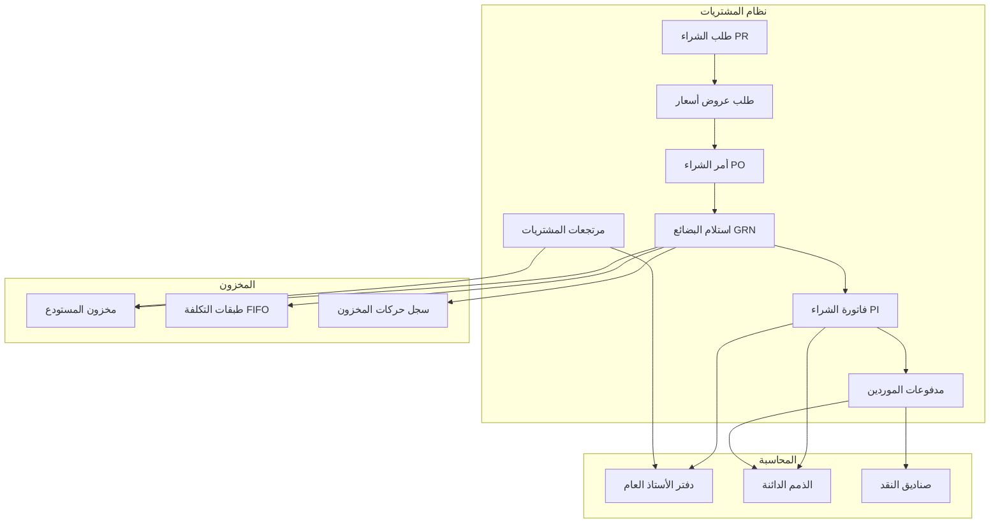
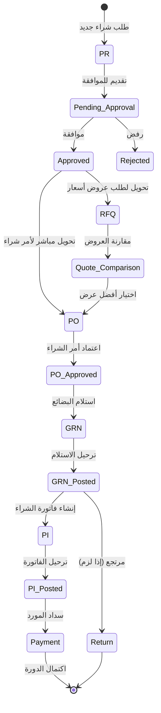
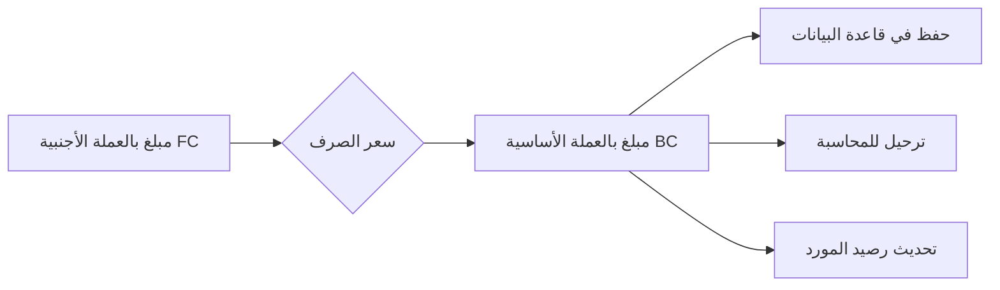

# 📦 نظام المشتريات الشامل - ERP صيدليات

> **تاريخ التقرير**: يناير 2026  
> **إصدار النظام**: v2.5  
> **نسبة الاكتمال**: 82%  
> **الحالة**: جاهز للإنتاج الأساسي

---

## 🎯 الهدف من نظام المشتريات

نظام المشتريات هو **العمود الفقري** لإدارة سلسلة التوريد في الصيدلية. يتحكم في:

### الأهمية الاستراتيجية:
1. **ضمان توفر المخزون**: منع نفاد الأدوية الحيوية
2. **تحسين التكاليف**: التفاوض مع الموردين والحصول على أفضل الأسعار
3. **مراقبة الجودة**: تتبع الدفعات وتواريخ الصلاحية
4. **الامتثال القانوني**: توثيق مصادر الأدوية والمستلزمات
5. **إدارة التدفق النقدي**: جدولة المدفوعات وإدارة الائتمان

### التكامل مع الوحدات الأخرى:



---

## 📊 المكونات الأساسية لنظام المشتريات

### 1️⃣ إدارة الموردين (Supplier Management)

#### الحالة الحالية: ✅ 95% مكتمل

#### هيكل جدول الموردين (`suppliers`):

| الحقل | النوع | الوصف |
|-------|------|-------|
| `id` | UUID | المعرف الفريد |
| `code` | TEXT | كود المورد التلقائي |
| `name` | TEXT | اسم المورد بالعربية |
| `name_en` | TEXT | اسم المورد بالإنجليزية |
| `phone` | TEXT | رقم الهاتف |
| `email` | TEXT | البريد الإلكتروني |
| `address` | TEXT | العنوان |
| `contact_person` | TEXT | جهة الاتصال |
| `tax_number` | TEXT | الرقم الضريبي |
| `credit_limit` | NUMERIC | حد الائتمان |
| `balance` | NUMERIC | الرصيد الحالي (قديم) |
| `balance_bc` | NUMERIC | الرصيد بالعملة الأساسية (YER) |
| `balance_fc` | NUMERIC | الرصيد بالعملة الأجنبية |
| `currency_code` | VARCHAR | العملة الافتراضية للمورد |
| `payment_terms` | TEXT | شروط السداد |
| `is_active` | BOOLEAN | حالة النشاط |

#### الوظائف المنفذة:
- ✅ إنشاء وتحديث بيانات الموردين
- ✅ توليد كود تلقائي للمورد (`generate_supplier_code()`)
- ✅ دعم العملات المتعددة (أرصدة مزدوجة FC/BC)
- ✅ تتبع الرصيد تلقائياً
- ✅ تقرير تقادم الذمم الدائنة (`get_supplier_aging()`)
- ⚠️ تصنيف الموردين (جزئي)
- ❌ نظام تقييم الموردين

#### إحصائيات حالية:
```
عدد الموردين: 6
```

---

### 2️⃣ دورة المشتريات الكاملة

#### مخطط سير العمل:



---

### 📋 طلبات الشراء (Purchase Requisitions - PR)

#### الحالة: ✅ 85% مكتمل

#### جدول `purchase_requisitions`:

| الحقل | النوع | الوصف |
|-------|------|-------|
| `id` | UUID | المعرف الفريد |
| `pr_number` | TEXT | رقم طلب الشراء |
| `warehouse_id` | UUID | المستودع الطالب |
| `requested_by` | UUID | المستخدم الطالب |
| `required_date` | DATE | تاريخ الحاجة |
| `priority` | TEXT | الأولوية (low/medium/high/urgent) |
| `status` | TEXT | الحالة (draft/submitted/approved/rejected) |
| `notes` | TEXT | ملاحظات |

#### العمليات المتاحة:
- ✅ إنشاء طلب شراء جديد
- ✅ إضافة بنود الطلب
- ✅ تقديم للموافقة (`useSubmitPR`)
- ✅ تحويل إلى طلب عروض أسعار (`useConvertPRToRFQ`)
- ✅ تحويل مباشر إلى أمر شراء (`useConvertPRToPO`)

#### إحصائيات:
```
طلبات الشراء: 2
```

---

### 📝 طلبات عروض الأسعار (RFQ)

#### الحالة: ⚠️ 70% مكتمل

#### الجداول:

**`rfq_requests`** - طلبات عروض الأسعار:
| الحقل | الوصف |
|-------|-------|
| `rfq_number` | رقم الطلب |
| `pr_id` | مرجع طلب الشراء |
| `status` | الحالة (draft/sent/received/closed) |
| `deadline` | آخر موعد للعروض |

**`rfq_suppliers`** - الموردين المدعوين:
| الحقل | الوصف |
|-------|-------|
| `rfq_id` | مرجع الطلب |
| `supplier_id` | المورد |
| `sent_at` | تاريخ الإرسال |

**`rfq_quotes`** - عروض الأسعار المستلمة:
| الحقل | الوصف |
|-------|-------|
| `rfq_id` | مرجع الطلب |
| `supplier_id` | المورد |
| `total_amount` | إجمالي العرض |
| `is_selected` | العرض المختار |

**`rfq_quote_items`** - بنود العروض:
| الحقل | الوصف |
|-------|-------|
| `quote_id` | مرجع العرض |
| `product_id` | المنتج |
| `unit_price` | سعر الوحدة |
| `quantity` | الكمية |

#### العمليات:
- ✅ إنشاء طلب عروض أسعار
- ✅ إضافة موردين للطلب
- ⚠️ استلام وتسجيل العروض (جزئي)
- ⚠️ مقارنة العروض (جزئي)
- ✅ اختيار العرض الفائز

#### إحصائيات:
```
طلبات RFQ: 0
```

---

### 🛒 أوامر الشراء (Purchase Orders - PO)

#### الحالة: ✅ 90% مكتمل

#### جدول `purchase_orders`:

| الحقل | النوع | الوصف |
|-------|------|-------|
| `id` | UUID | المعرف الفريد |
| `po_number` | TEXT | رقم أمر الشراء |
| `supplier_id` | UUID | المورد |
| `warehouse_id` | UUID | المستودع |
| `pr_id` | UUID | مرجع طلب الشراء (اختياري) |
| `rfq_id` | UUID | مرجع طلب العروض (اختياري) |
| `quote_id` | UUID | مرجع العرض المختار (اختياري) |
| `currency_code` | VARCHAR | العملة |
| `exchange_rate` | NUMERIC | سعر الصرف |
| `expected_date` | DATE | تاريخ الاستلام المتوقع |
| `status` | TEXT | الحالة (draft/sent/approved/partial/completed/cancelled) |
| `payment_terms` | TEXT | شروط السداد |
| `subtotal_fc` | NUMERIC | المجموع الفرعي (عملة أجنبية) |
| `subtotal_bc` | NUMERIC | المجموع الفرعي (عملة أساسية) |
| `tax_amount_fc` | NUMERIC | الضريبة (FC) |
| `tax_amount_bc` | NUMERIC | الضريبة (BC) |
| `total_amount_fc` | NUMERIC | الإجمالي (FC) |
| `total_amount_bc` | NUMERIC | الإجمالي (BC) |

#### العمليات المنفذة:
- ✅ إنشاء أمر شراء جديد
- ✅ إنشاء من طلب شراء PR
- ✅ إنشاء من عرض سعر RFQ
- ✅ دعم العملات المتعددة (FC/BC)
- ✅ إضافة بنود متعددة
- ✅ اعتماد أمر الشراء
- ✅ تتبع حالة الأمر
- ⚠️ إرسال للمورد عبر البريد (غير مفعل)

#### إحصائيات:
```
أوامر الشراء: 43
```

---

### 📦 استلام البضائع (Goods Receipt Notes - GRN)

#### الحالة: ✅ 90% مكتمل

#### جدول `goods_receipts`:

| الحقل | النوع | الوصف |
|-------|------|-------|
| `id` | UUID | المعرف الفريد |
| `grn_number` | TEXT | رقم إيصال الاستلام |
| `po_id` | UUID | مرجع أمر الشراء |
| `supplier_id` | UUID | المورد |
| `warehouse_id` | UUID | المستودع |
| `received_at` | TIMESTAMP | تاريخ الاستلام |
| `status` | TEXT | الحالة (draft/posted) |
| `currency_code` | VARCHAR | العملة |
| `exchange_rate` | NUMERIC | سعر الصرف |
| `total_amount_fc` | NUMERIC | الإجمالي (FC) |
| `total_amount_bc` | NUMERIC | الإجمالي (BC) |

#### جدول `grn_items`:

| الحقل | النوع | الوصف |
|-------|------|-------|
| `grn_id` | UUID | مرجع الاستلام |
| `product_id` | UUID | المنتج |
| `quantity_ordered` | NUMERIC | الكمية المطلوبة |
| `quantity_received` | NUMERIC | الكمية المستلمة |
| `unit_cost_fc` | NUMERIC | تكلفة الوحدة (FC) |
| `unit_cost_bc` | NUMERIC | تكلفة الوحدة (BC) |
| `lot_number` | TEXT | رقم الدفعة |
| `expiry_date` | DATE | تاريخ الانتهاء |

#### دالة الترحيل `post_goods_receipt()`:

```sql
-- ماذا تفعل الدالة:
1. التحقق من صحة البيانات
2. تحديث حالة الاستلام إلى 'posted'
3. إضافة الكميات إلى مخزون المستودع (warehouse_stock)
4. إنشاء طبقات تكلفة FIFO (inventory_cost_layers)
5. تسجيل حركات المخزون (stock_ledger)
6. تحديث حالة أمر الشراء
```

#### العمليات:
- ✅ إنشاء إيصال استلام من أمر شراء
- ✅ تسجيل الكميات المستلمة
- ✅ تسجيل رقم الدفعة وتاريخ الانتهاء
- ✅ ترحيل الاستلام (تحديث المخزون + FIFO)
- ✅ دعم العملات المتعددة
- ✅ الاستلام الجزئي

#### إحصائيات:
```
إيصالات الاستلام: 11
طبقات FIFO: 9
```

---

### 🧾 فواتير الشراء (Purchase Invoices - PI)

#### الحالة: ✅ 92% مكتمل

#### جدول `purchase_invoices`:

| الحقل | النوع | الوصف |
|-------|------|-------|
| `id` | UUID | المعرف الفريد |
| `pi_number` | TEXT | رقم الفاتورة الداخلي |
| `supplier_invoice_no` | TEXT | رقم فاتورة المورد |
| `supplier_id` | UUID | المورد |
| `po_id` | UUID | مرجع أمر الشراء |
| `grn_id` | UUID | مرجع إيصال الاستلام |
| `warehouse_id` | UUID | المستودع |
| `invoice_date` | DATE | تاريخ الفاتورة |
| `due_date` | DATE | تاريخ الاستحقاق |
| `currency_code` | VARCHAR | العملة |
| `exchange_rate` | NUMERIC | سعر الصرف |
| `status` | TEXT | الحالة (draft/posted/cancelled) |
| `payment_status` | TEXT | حالة السداد (unpaid/partial/paid) |
| `subtotal_fc/bc` | NUMERIC | المجموع الفرعي |
| `discount_amount_fc/bc` | NUMERIC | الخصم |
| `tax_amount_fc/bc` | NUMERIC | الضريبة |
| `total_amount_fc/bc` | NUMERIC | الإجمالي |
| `paid_amount_fc/bc` | NUMERIC | المبلغ المدفوع |

#### دالة الترحيل `post_purchase_invoice()`:

```sql
-- القيود المحاسبية المولدة:
-- 1. مدين: حساب المخزون / مصروفات
-- 2. دائن: حساب المورد (الذمم الدائنة)
-- 3. مدين: ضريبة القيمة المضافة المستردة
-- 4. تحديث رصيد المورد
```

#### العمليات:
- ✅ إنشاء فاتورة من إيصال استلام
- ✅ إنشاء فاتورة مباشرة
- ✅ التحقق من تكرار رقم فاتورة المورد (`check_duplicate_supplier_invoice`)
- ✅ التحقق من فترة الترحيل (`validate_posting_period`)
- ✅ ترحيل تلقائي للمحاسبة
- ✅ تحديث رصيد المورد (FC/BC)
- ✅ دعم العملات المتعددة

#### إحصائيات:
```
فواتير الشراء: 8
```

---

### ↩️ مرتجعات المشتريات (Purchase Returns)

#### الحالة: ⚠️ 75% مكتمل

#### جدول `purchase_returns`:

| الحقل | النوع | الوصف |
|-------|------|-------|
| `id` | UUID | المعرف الفريد |
| `return_number` | TEXT | رقم المرتجع |
| `supplier_id` | UUID | المورد |
| `invoice_id` | UUID | مرجع فاتورة الشراء |
| `return_date` | DATE | تاريخ الإرجاع |
| `status` | TEXT | الحالة (draft/posted) |
| `reason` | TEXT | سبب الإرجاع |
| `total_amount` | NUMERIC | إجمالي المرتجع |

#### دالة الترحيل `post_purchase_return()`:

```sql
-- العمليات:
1. عكس طبقات FIFO المستهلكة
2. تخفيض مخزون المستودع
3. إنشاء قيود محاسبية عكسية
4. تخفيض رصيد المورد
5. إنشاء إشعار دائن (Debit Note)
```

#### العمليات:
- ✅ إنشاء مرتجع من فاتورة شراء
- ✅ تحديد البنود والكميات المرتجعة
- ⚠️ ترحيل المرتجع (يحتاج اختبار)
- ⚠️ استعادة طبقات FIFO (يحتاج تحقق)
- ❌ طباعة إشعار دائن

#### إحصائيات:
```
مرتجعات المشتريات: 0
```

---

### 💰 مدفوعات الموردين (Supplier Payments)

#### الحالة: ⚠️ 80% مكتمل

#### جدول `supplier_payments`:

| الحقل | النوع | الوصف |
|-------|------|-------|
| `id` | UUID | المعرف الفريد |
| `payment_number` | TEXT | رقم السند |
| `supplier_id` | UUID | المورد |
| `payment_date` | DATE | تاريخ السداد |
| `currency_code` | VARCHAR | العملة |
| `exchange_rate` | NUMERIC | سعر الصرف |
| `amount_fc` | NUMERIC | المبلغ (FC) |
| `amount_bc` | NUMERIC | المبلغ (BC) |
| `payment_method` | TEXT | طريقة الدفع |
| `cash_box_id` | UUID | صندوق النقد |
| `status` | TEXT | الحالة |

#### جدول `supplier_payment_allocations`:

| الحقل | الوصف |
|-------|-------|
| `payment_id` | مرجع السداد |
| `invoice_id` | مرجع الفاتورة |
| `amount_fc` | المبلغ المخصص (FC) |
| `amount_bc` | المبلغ المخصص (BC) |

#### دالة الترحيل `post_supplier_payment()`:

```sql
-- القيود المحاسبية:
-- مدين: حساب المورد (الذمم الدائنة)
-- دائن: حساب الصندوق / البنك
-- تحديث paid_amount في الفواتير
-- تحديث رصيد المورد
```

#### العمليات:
- ✅ إنشاء سند صرف للمورد
- ✅ تخصيص المبلغ على الفواتير
- ✅ ترحيل السداد (GL + رصيد المورد)
- ✅ دعم العملات المتعددة
- ⚠️ خصومات السداد المبكر (غير مفعل)

#### إحصائيات:
```
مدفوعات الموردين: 0
```

---

## 🔧 المتطلبات التقنية

### 1️⃣ التكامل مع المخزون

#### طبقات التكلفة FIFO (`inventory_cost_layers`):

| الحقل | الوصف |
|-------|-------|
| `product_id` | المنتج |
| `warehouse_id` | المستودع |
| `source_document_type` | نوع المستند (GRN) |
| `source_document_id` | معرف المستند |
| `unit_cost` | تكلفة الوحدة (بالعملة الأساسية YER) |
| `quantity_original` | الكمية الأصلية |
| `quantity_remaining` | الكمية المتبقية |
| `lot_number` | رقم الدفعة |
| `expiry_date` | تاريخ الانتهاء |

#### الدوال:
- `add_cost_layer()` - إضافة طبقة جديدة عند الاستلام
- `consume_fifo_layers()` - استهلاك عند البيع
- `consume_fifo_layers_enhanced()` - استهلاك محسّن
- `allocate_fifo_cost()` - حساب تكلفة البضاعة المباعة

### 2️⃣ دعم العملات المتعددة

#### القاعدة الذهبية:
```
العملة الأساسية = الريال اليمني (YER)
جميع القيود المحاسبية = بالريال اليمني
جميع أرصدة الموردين = بالريال اليمني
طبقات FIFO = بالريال اليمني
```

#### مخطط التحويل:



#### الحقول المزدوجة في كل جدول:
- `*_fc` - قيمة بالعملة الأجنبية
- `*_bc` - قيمة بالعملة الأساسية (YER)

---

## 📱 واجهات المستخدم المتوفرة

### الصفحات الموجودة:

| الصفحة | المسار | الحالة |
|--------|--------|--------|
| إدارة الموردين | `/suppliers` | ✅ 95% |
| تفاصيل المورد | `/suppliers/:id` | ✅ 90% |
| تقادم الموردين | `/suppliers/aging` | ✅ 85% |
| طلبات الشراء | `/purchases/requisitions` | ✅ 85% |
| عرض طلب الشراء | `/purchases/requisitions/:id` | ✅ 85% |
| طلبات عروض الأسعار | `/purchases/rfq` | ⚠️ 70% |
| أوامر الشراء | `/purchase-orders` | ✅ 90% |
| استلام البضائع | `/goods-receipts` | ✅ 90% |
| فواتير الشراء | `/purchase-invoices` | ✅ 92% |
| مرتجعات المشتريات | `/purchase-returns` | ⚠️ 75% |
| مدفوعات الموردين | `/supplier-payments` | ⚠️ 80% |
| كشف حساب المورد | `/supplier-statement/:id` | ✅ 85% |

---

## ⚙️ الوظائف البرمجية

### دوال قاعدة البيانات (23 دالة):

| الدالة | الوظيفة | الحالة |
|--------|---------|--------|
| `post_goods_receipt()` | ترحيل الاستلام + FIFO | ✅ |
| `post_purchase_invoice()` | ترحيل الفاتورة + GL | ✅ |
| `post_purchase_return()` | ترحيل المرتجع | ⚠️ |
| `post_supplier_payment()` | ترحيل السداد | ✅ |
| `check_duplicate_supplier_invoice()` | التحقق من التكرار | ✅ |
| `validate_purchase_invoice_currency_amounts()` | التحقق من العملات | ✅ |
| `calculate_base_currency_purchase()` | تحويل للعملة الأساسية | ✅ |
| `generate_supplier_code()` | توليد كود المورد | ✅ |
| `generate_supplier_payment_number()` | توليد رقم السند | ✅ |
| `generate_purchase_return_number()` | توليد رقم المرتجع | ✅ |
| `get_supplier_aging()` | تقرير التقادم | ✅ |
| `get_returnable_purchase_invoices()` | الفواتير القابلة للإرجاع | ✅ |
| `rebuild_supplier_balance()` | إعادة بناء الرصيد | ✅ |
| `add_cost_layer()` | إضافة طبقة FIFO | ✅ |
| `consume_fifo_layers()` | استهلاك طبقات FIFO | ✅ |
| `allocate_fifo_cost()` | تخصيص تكلفة FIFO | ✅ |
| `approve_approval_step()` | موافقة خطوة | ✅ |
| `reject_approval_request()` | رفض طلب موافقة | ✅ |

---

## 🔄 نظام الموافقات (Approval Workflow)

### الحالة: ✅ 85% مكتمل

### الجداول:

**`approval_workflows`** - تعريف سير العمل:
```sql
- workflow_name: اسم سير العمل
- document_type: نوع المستند (purchase_order, purchase_requisition, ...)
- is_active: مفعل أم لا
```

**`approval_steps`** - خطوات الموافقة:
```sql
- workflow_id: سير العمل
- step_order: ترتيب الخطوة
- step_name: اسم الخطوة
- approver_role: دور المعتمد
- min_amount / max_amount: حدود المبلغ
- is_required: إلزامية
```

**`approval_requests`** - طلبات الموافقة:
```sql
- document_type: نوع المستند
- document_id: معرف المستند
- workflow_id: سير العمل
- current_step: الخطوة الحالية
- status: pending/approved/rejected
```

**`approval_history`** - سجل الموافقات:
```sql
- request_id: طلب الموافقة
- step_id: الخطوة
- action: approve/reject
- action_by: المعتمد
- comments: الملاحظات
```

---

## 📊 ملخص حالة النظام

### الإحصائيات الحالية:

| المكون | العدد |
|--------|-------|
| الموردين | 6 |
| طلبات الشراء PR | 2 |
| طلبات عروض الأسعار RFQ | 0 |
| أوامر الشراء PO | 43 |
| إيصالات الاستلام GRN | 11 |
| فواتير الشراء PI | 8 |
| مرتجعات المشتريات | 0 |
| مدفوعات الموردين | 0 |
| طبقات FIFO | 9 |

### نسب الإنجاز:

```
إدارة الموردين:        ████████████████████░░ 95%
طلبات الشراء PR:       █████████████████░░░░░ 85%
طلبات عروض الأسعار:    ██████████████░░░░░░░░ 70%
أوامر الشراء PO:       ██████████████████░░░░ 90%
استلام البضائع GRN:    ██████████████████░░░░ 90%
فواتير الشراء PI:      ██████████████████░░░░ 92%
مرتجعات المشتريات:     ███████████████░░░░░░░ 75%
مدفوعات الموردين:      ████████████████░░░░░░ 80%
نظام الموافقات:        █████████████████░░░░░ 85%

المتوسط العام:         ████████████████░░░░░░ 82%
```

---

## 🚀 خطة استكمال النظام

### المرحلة 1: الأولوية القصوى (أسبوع 1-2)

| المهمة | الوصف | الأولوية |
|--------|-------|----------|
| اختبار مرتجعات المشتريات | التحقق من استعادة FIFO والقيود العكسية | 🔴 حرج |
| استكمال مدفوعات الموردين | اختبار شامل للسداد والتخصيص | 🔴 حرج |
| مطابقة الفواتير مع GRN | التحقق التلقائي من التطابق | 🟡 مهم |

### المرحلة 2: تحسينات (أسبوع 3-4)

| المهمة | الوصف |
|--------|-------|
| نظام RFQ الكامل | مقارنة العروض + اختيار الأفضل |
| خصومات السداد المبكر | تفعيل الخصومات النقدية |
| تقارير المشتريات | تحليلات المشتريات حسب المورد/الفترة |

### المرحلة 3: ميزات متقدمة (أسبوع 5-6)

| المهمة | الوصف |
|--------|-------|
| نظام تقييم الموردين | تقييم الأداء والجودة |
| إعادة الطلب التلقائي | اقتراحات شراء عند الحد الأدنى |
| تكاليف الاستيراد | توزيع تكاليف الشحن والجمارك |

---

## 📋 التوصيات الفنية

### 1. تحسين الأداء:
- إضافة فهارس على الحقول المستخدمة في البحث
- تحسين استعلامات التقارير الثقيلة
- استخدام materialized views للتقارير

### 2. تحسين الأمان:
- مراجعة سياسات RLS على جميع الجداول
- تسجيل جميع العمليات في سجل المراجعة
- فصل الصلاحيات حسب الأدوار

### 3. تحسين تجربة المستخدم:
- إضافة إشعارات عند الموافقات المطلوبة
- تحسين البحث والتصفية
- إضافة معاينة الطباعة

---

## 🎯 الخلاصة

نظام المشتريات **جاهز للإنتاج الأساسي** بنسبة 82%. العمليات الأساسية تعمل بشكل كامل:
- ✅ إدارة الموردين
- ✅ أوامر الشراء
- ✅ استلام البضائع مع FIFO
- ✅ فواتير الشراء مع الترحيل المحاسبي
- ✅ دعم العملات المتعددة (FC/BC)
- ✅ نظام الموافقات

**المطلوب لاستكمال النظام:**
1. اختبار شامل للمرتجعات والمدفوعات
2. استكمال نظام RFQ
3. تقارير المشتريات المتقدمة
